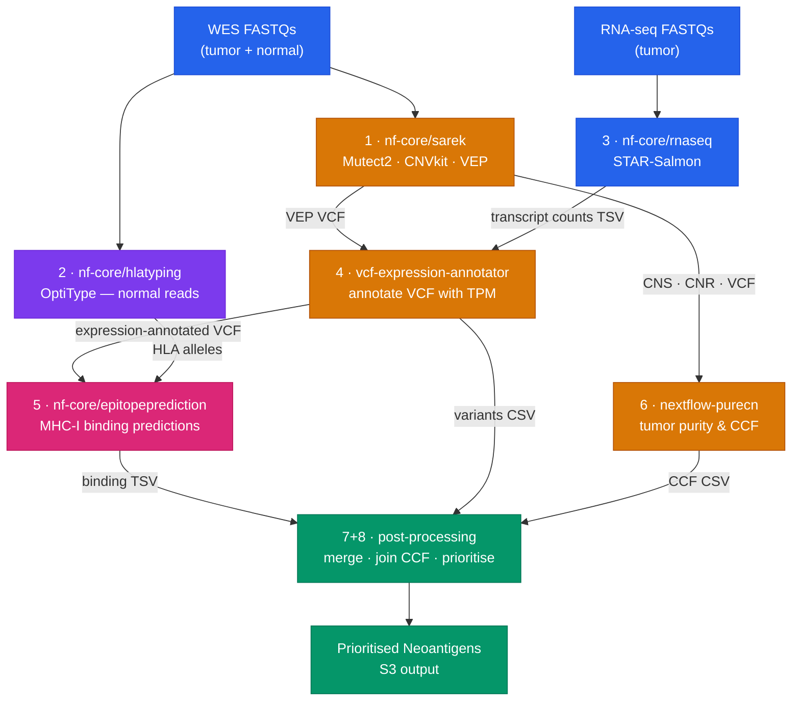

# neoantigen-prefect

Prefect 3 orchestration layer for end-to-end neoantigen prediction from tumor–normal WES and RNA-seq data, running all compute on [Seqera Platform](https://seqera.io).

---

## Overview

This repo contains no Nextflow code itself. It acts as a supervisor that:

1. Writes per-patient samplesheets to S3 via pre-run scripts (executed on the compute head node before Nextflow starts)
2. Launches 7 Nextflow pipelines in the correct dependency order via the Seqera Platform API
3. Polls each run until completion before triggering downstream steps
4. Supports automatic `-resume` on Prefect retries and manual resume seeding via `--resume-workflow`
5. Returns the final S3 output path

All heavy compute runs on AWS Batch through Seqera Platform — the Prefect flow runs locally (or in Prefect Cloud) and just orchestrates API calls.

---

## Pipeline DAG




Steps 1, 2, and 3 launch in parallel. Steps 4 and 6 run in parallel after sarek. Step 5 runs after 4 and 2. Steps 7+8 run after 5, 4, and 6.

---

## Repository Structure

```
neoantigen-prefect/
├── neoantigen_flow.py      # Prefect flow — main DAG definition
├── tasks.py                # Prefect tasks: dataset upload, pipeline launch + poll
├── seqera_client.py        # Low-level Seqera Platform REST API client
├── config.py               # SeqeraConfig, PipelineIds, output path helpers
├── run_flow.py             # CLI entrypoint
├── samplesheets/           # Per-patient input samplesheets
│   ├── PID262622_wes.csv
│   ├── PID262622_hlatyping.csv
│   └── PID262622_rnaseq.csv
├── pyproject.toml
├── .env.example
└── README.md
```

---

## Seqera Launchpad Pipelines

The following pipelines must be added to your Seqera workspace before running. IDs are stored in `config.py`.

| Step | Pipeline | Version | Source |
|------|----------|---------|--------|
| 1 | nf-core/sarek | 3.5.1 | https://github.com/nf-core/sarek |
| 2 | nf-core/hlatyping | master | https://github.com/tylergross97/hlatyping |
| 3 | nf-core/rnaseq | latest | https://github.com/nf-core/rnaseq |
| 4 | vcf-expression-annotator | latest | https://github.com/tylergross97/vcf_expression_annotation |
| 5 | nf-core/epitopeprediction | latest | https://github.com/nf-core/epitopeprediction |
| 6 | nextflow-purecn | latest | https://github.com/tylergross97/nextflow_purecn |
| 7+8 | post-processing | latest | https://github.com/tylergross97/post-processing |

### Pipeline-specific configuration notes

**nf-core/sarek**: Pin revision to `3.5.1`. Earlier versions have a `Channel.empty([[]])` incompatibility with Nextflow ≥25.10.

**nf-core/hlatyping**: Use the custom fork at `https://github.com/tylergross97/hlatyping` (revision `master`). This fork patches Nextflow ≥25.x compatibility. Add the following to the launchpad configText to disable Seqera Fusion — YARA_MAPPER (seqan-based) uses async file I/O (`fallocate`/`resize`) that is incompatible with the Fusion FUSE filesystem:

```groovy
fusion {
    enabled = false
}
wave {
    enabled = true
}
```

---

## Setup

### 1. Install dependencies

```bash
uv sync
# or
pip install -e .
```

### 2. Configure credentials

```bash
cp .env.example .env
```

Edit `.env` and set `TOWER_ACCESS_TOKEN`. All other values default to the configured workspace.

```
TOWER_ACCESS_TOKEN=your_seqera_token_here
```

Optional overrides:

```
SEQERA_WORKSPACE_ID=242762077936819
SEQERA_COMPUTE_ENV_ID=2uTyYrtzkHWBJwd6wFsK8I
SEQERA_WORK_DIR=s3://your-bucket/work
SEQERA_BASE_OUTDIR=s3://your-bucket/neoantigen
```

### 3. Update pipeline IDs

If you're using a different workspace, add each pipeline to your Seqera launchpad and update the IDs in `config.py`:

```python
@dataclass
class PipelineIds:
    sarek: int | None = 63782075010441
    hlatyping: int | None = 90243648955829
    rnaseq: int | None = 62172493141868
    vcf_expression_annotator: int | None = 66496502716200
    epitopeprediction: int | None = 166495825050255
    purecn: int | None = 86054682767651
    post_processing: int | None = 227282378461823
```

---

## Usage

### Samplesheet formats

**WES (`nf-core/sarek` format):**
```csv
patient,sex,status,sample,lane,fastq_1,fastq_2
PID001,XX,0,PID001_N,1,s3://bucket/normal_R1.fastq.gz,s3://bucket/normal_R2.fastq.gz
PID001,XX,1,PID001_T,1,s3://bucket/tumor_R1.fastq.gz,s3://bucket/tumor_R2.fastq.gz
```

**HLA typing (`nf-core/hlatyping` format — normal reads only):**
```csv
sample,fastq_1,fastq_2
PID001_N,s3://bucket/normal_R1.fastq.gz,s3://bucket/normal_R2.fastq.gz
```

Note: the `seq_type` column was removed in nf-core/hlatyping v2.x.

**RNA-seq (`nf-core/rnaseq` format):**
```csv
sample,fastq_1,fastq_2,strandedness
PID001_T,s3://bucket/rna_R1.fastq.gz,s3://bucket/rna_R2.fastq.gz,auto
```

### Run

```bash
python run_flow.py \
  --patient-id PID001 \
  --wes-samplesheet samplesheets/PID001_wes.csv \
  --hlatyping-samplesheet samplesheets/PID001_hlatyping.csv \
  --rnaseq-samplesheet samplesheets/PID001_rnaseq.csv \
  --tumor-sample PID001_T \
  --normal-sample PID001_N \
  --sex XX
```

| Argument | Required | Description |
|----------|----------|-------------|
| `--patient-id` | yes | Patient identifier (used for output paths and run names) |
| `--wes-samplesheet` | yes | Path to sarek-format WES CSV |
| `--hlatyping-samplesheet` | yes | Path to hlatyping-format CSV (normal reads only) |
| `--rnaseq-samplesheet` | yes | Path to rnaseq-format CSV |
| `--tumor-sample` | yes | Tumor sample name as it appears in the sarek samplesheet (e.g. `PID001_T`) |
| `--normal-sample` | yes | Normal sample name as it appears in the sarek samplesheet (e.g. `PID001_N`) |
| `--sex` | no | `XX` or `XY` (default: `XX`) |
| `--run-tag` | no | Short label appended to run names (default: patient ID + UTC date) |
| `--resume-workflow` | no | `PIPELINE_NAME:WORKFLOW_ID` — resume from an existing run (repeatable) |

### Resuming from a previous run

If a flow run fails partway through, you can resume each pipeline from its last Seqera run instead of starting from scratch. Pass `--resume-workflow` once per pipeline you want to resume:

```bash
python run_flow.py \
  --patient-id PID001 \
  --tumor-sample PID001_T \
  --normal-sample PID001_N \
  ... \
  --resume-workflow "nf-core/sarek:5Zpxj5YTfyiacx" \
  --resume-workflow "nf-core/rnaseq:qzhhZjJ00GctM"
```

Pipelines not listed will start fresh. The resume uses `GET /workflow/{id}/launch` to obtain the correct workflow-entity launchId and embedded sessionId — this is required because Seqera rejects `resume=true` when the launchId has `entity=pipeline`.

Automatic resume also occurs on Prefect task retries: if a pipeline fails during a run, the task captures its workflowId and uses it for resume on the next Prefect retry attempt.

### Override pipeline IDs at runtime

Pipeline IDs can be overridden via CLI flags or environment variables without editing `config.py`:

```bash
python run_flow.py ... --sarek-id 99999 --post-processing-id 88888
```

Or via environment variables: `PIPELINE_SAREK_ID`, `PIPELINE_HLATYPING_ID`, etc.

---

## Outputs

All outputs land under `SEQERA_BASE_OUTDIR/{patient_id}/`:

```
s3://bucket/neoantigen/PID001/
├── sarek/
├── hlatyping/
├── rnaseq/
├── vcf_expression_annotator/
├── epitopeprediction/
├── purecn/
└── post_processing/
    ├── {sample}/merged_df_final2.csv        # all candidates with binding predictions
    ├── {sample}_filtered_variants.csv        # prioritised neoantigens with CCF
    └── *.png                                 # QC plots
```

Samplesheets are written to `SEQERA_BASE_OUTDIR/{patient_id}/samplesheets/` on S3 before each pipeline starts.

---

## Architecture Notes

- **Samplesheet delivery**: samplesheets are written to S3 via bash heredoc pre-run scripts that execute on the Seqera compute head node before Nextflow starts. This avoids nf-schema `^\S+\.csv$` validation failures that occur with dataset:// or API HTTPS URLs. The pre-run scripts are sourced (not subprocess-executed) by `nf-launcher.sh`, so `set -u` must not be used.
- **sarek output paths**: nf-core/sarek v3.5.1 uses a `{tumor}_vs_{normal}` naming convention for somatic variant calling outputs. VEP-annotated VCFs land at `annotation/vep/{T}_vs_{N}/{T}_vs_{N}.mutect2.filtered_VEP.ann.vcf.gz`; CNVkit files at `variant_calling/cnvkit/{T}_vs_{N}/{T}.cns` and `.cnr`. Both `--tumor-sample` and `--normal-sample` are required to construct these paths.
- **PureCN S3 path handling**: the `nextflow_purecn` pipeline's `resolveFilePath` helper and `validateParameters` were patched to handle `s3://` URIs (in addition to absolute and relative local paths). Without this fix the `.exists()` check always fails for S3 inputs.
- **Prefect tasks** run in worker threads. Parallelism is achieved by submitting tasks with `.submit()` and resolving futures with `.result()` at dependency boundaries.
- **Resume mechanism**: on Prefect retry, `tasks.py` passes the failed run's workflowId as `resume_from_workflow_id` to `SeqeraClient.launch_pipeline()`, which calls `GET /workflow/{id}/launch` to get the workflow-entity launchId and sessionId. Using the pipeline-entity launchId with `resume=true` returns a 400 error from Seqera.
- **Seqera API**: pipelines are launched via `POST /workflow/launch?workspaceId={id}` after fetching the pipeline's saved launch config. Datasets for post-processing input are uploaded via `POST /workspaces/{id}/datasets/{id}/upload`.
- **No caching** on dataset upload tasks — Seqera datasets are cheap to create and caching caused stale references after deletion.

---

## Related Repositories

| Repo | Description |
|------|-------------|
| [neoantigen_prediction_workflow](https://github.com/tylergross97/neoantigen_prediction_workflow) | Nextflow meta-pipeline and biological background |
| [post-processing](https://github.com/tylergross97/post-processing) | Nextflow pipeline wrapping downstream + tertiary analysis scripts |
| [vcf_expression_annotation](https://github.com/tylergross97/vcf_expression_annotation) | VCF expression annotator pipeline |
| [nextflow_purecn](https://github.com/tylergross97/nextflow_purecn) | Nextflow wrapper for PureCN clonality estimation |
