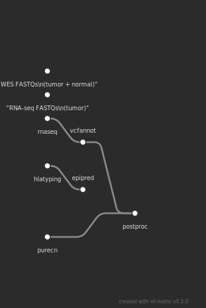
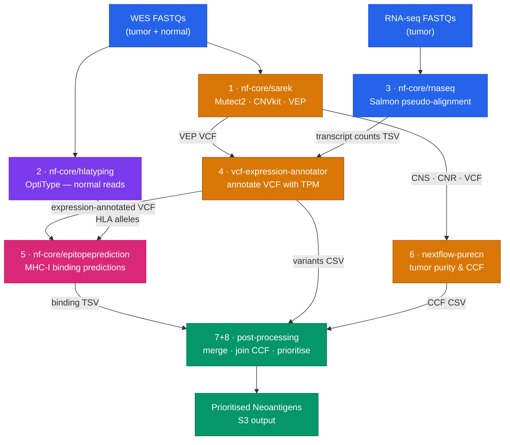

# neoantigen-prefect

Prefect 3 orchestration layer for end-to-end neoantigen prediction from tumor–normal WES and RNA-seq data, running all compute on [Seqera Platform](https://seqera.io).

---

## Overview

This repo contains no Nextflow code itself. It acts as a supervisor that:

1. Writes per-patient samplesheets to S3 via pre-run scripts (executed on the compute head node before Nextflow starts)
2. Launches 7 Nextflow pipelines in the correct dependency order via the Seqera Platform API
3. Polls each run until completion before triggering downstream steps
4. Supports manual resume seeding via `--resume-workflow` to skip completed pipelines on re-runs
5. Returns the final S3 output path

All heavy compute runs on AWS Batch through Seqera Platform — the Prefect flow runs locally (or in Prefect Cloud) and just orchestrates API calls.

---

## Pipeline DAG





Steps 1, 2, and 3 launch in parallel. Steps 4 and 6 run in parallel after sarek. Step 5 runs after 4 and 2. Steps 7+8 run after 5, 4, and 6.

---

## Repository Structure

```
neoantigen-prefect/
├── neoantigen_flow.py      # Prefect flow — main DAG definition
├── tasks.py                # Prefect tasks: dataset upload, pipeline launch + poll
├── seqera_client.py        # Low-level Seqera Platform REST API client
├── config.py               # SeqeraConfig, PipelineIds, output path helpers
├── run_flow.py             # Full CLI entrypoint (all arguments explicit)
├── run_patient.py          # Convenience launcher — derives paths from PID
├── samplesheets/           # Per-patient input samplesheets
│   ├── PID262622_wes.csv
│   ├── PID262622_hlatyping.csv
│   ├── PID262622_rnaseq.csv
│   ├── PID147771_wes.csv
│   ├── PID147771_hlatyping.csv
│   └── PID147771_rnaseq.csv
├── tests/
│   ├── test_client.py      # SeqeraClient unit tests (HTTP mocked with respx)
│   ├── test_tasks.py       # Task utilities + pipeline parameter correctness
│   └── test_config.py      # Output path helpers + dataclass validation
├── pyproject.toml
├── .env.example
└── README.md
```

---

## How It Works

### The two frameworks and why both are needed

**Seqera Platform** is a commercial platform for running Nextflow pipelines on cloud or HPC infrastructure. If you know Nextflow, think of it as the layer that replaces manually managing compute environments, job schedulers, container registries, and run monitoring. You configure a workspace once — pointing at your AWS Batch environment, SLURM cluster, GCP, Azure, or Kubernetes cluster — and from then on, launching a pipeline is a single API call. Every run is tracked, logged, and resumable. Seqera exposes all of this through a REST API.

**Prefect** is a Python workflow orchestration framework — roughly analogous to Nextflow, but for Python functions instead of bioinformatics tools. A `@flow` is a top-level workflow; `@task`s are the units of work inside it. Prefect handles execution order, parallelism, failure tracking, retries, and a monitoring UI for the orchestration layer.

The key insight is that **Nextflow handles parallelism within a single pipeline; Prefect handles ordering across multiple pipelines**. Neoantigen prediction requires seven pipelines that depend on each other's outputs. That cross-pipeline dependency logic has to live somewhere above Nextflow — that's what this repo is.

Prefect does not run any Nextflow itself. It calls the Seqera Platform API: "launch this pipeline, wait until it finishes, then launch the next one." Seqera handles everything that happens inside each pipeline run.

```
you → run_flow.py → Prefect flow → Seqera API → Nextflow (on your compute backend)
                                                    ↑
                                       AWS Batch / SLURM / GCP / Azure / Kubernetes
```

---

### What each file does

**`config.py`** — configuration and output path wiring

Two dataclasses live here:
- `SeqeraConfig` — your Seqera credentials, workspace ID, compute environment ID, and S3/storage base paths. Values are read from environment variables with sensible defaults.
- `PipelineIds` — the integer IDs of the 7 pipelines as they appear in your Seqera launchpad. To find an ID, open the pipeline in Seqera Platform — the URL contains `/pipelines/{id}`.

Also contains a set of path-builder functions (`sarek_vep_vcf`, `hlatyping_result`, `rnaseq_transcript_counts_tsv`, etc.). These encode where each nf-core pipeline writes its outputs by default. They are the glue layer — the flow uses them to construct the input paths for downstream pipelines from the output paths of upstream ones.

---

**`seqera_client.py`** — raw HTTP wrapper for the Seqera REST API

A thin `httpx`-based client that wraps the five Seqera API endpoints this project uses:

| Method | Endpoint | Used for |
|--------|----------|----------|
| `GET` | `/pipelines/{id}/launch` | Fetch a launchpad pipeline's saved config |
| `GET` | `/workflow/{id}/launch` | Fetch a past run's launch config (needed for resume) |
| `POST` | `/workflow/launch` | Launch a pipeline run |
| `GET` | `/workflow/{id}` | Poll run status |
| `POST` | `/workspaces/{id}/datasets/{id}/upload` | Upload a samplesheet as a Seqera Dataset |

Nothing in this file knows about Prefect or the neoantigen workflow — it is a generic Seqera API client.

---

**`tasks.py`** — Prefect tasks (the units of work)

Two `@task` functions:

`run_pipeline` — the core task. Launches a pipeline via `SeqeraClient.launch_pipeline()`, logs a link to the Seqera monitoring UI, then blocks in a poll loop (every 60 seconds) until the run reaches a terminal state. If the run fails, it raises `RuntimeError`, which Prefect sees as a task failure. On a Prefect retry, it uses the captured Seqera workflow ID to resume from where it left off rather than starting over (see [Resume mechanism](#resume-mechanism) below).

`create_and_upload_dataset` — creates a named Seqera Dataset, uploads a CSV to it, and returns an HTTPS download URL. Used only for the post-processing step's input samplesheet; all other samplesheets are delivered via pre-run scripts.

---

**`neoantigen_flow.py`** — the Prefect flow (the DAG)

This is where the dependency graph is expressed. The `@flow` function `neoantigen_flow` launches the seven pipelines in the order dictated by their data dependencies:

- **Steps 1, 2, 3** (sarek, hlatyping, rnaseq) are submitted in parallel via `.submit()`, staggered by 5 seconds to avoid Seqera API concurrency errors.
- **Step 4** (vcf-expression-annotator) uses `wait_for=[sarek_future, rnaseq_future]` — Prefect will not submit this task until both upstream futures have resolved.
- **Step 6** (PureCN) uses `wait_for=[sarek_future]` and runs in parallel with step 4.
- **Step 5** (epitopeprediction) uses `wait_for=[vcf_annot_future, hlatyping_future]`.
- **Steps 7+8** (post-processing) explicitly calls `.result()` on its three dependencies before building the input samplesheet, then submits the final pipeline.

The file also contains all fixed pipeline parameters (`SAREK_PARAMS`, `RNASEQ_PARAMS`, etc.) — every non-dynamic parameter that would otherwise need to be set in the Seqera launchpad UI.

---

**`run_flow.py`** — CLI entrypoint

Parses command-line arguments, reads samplesheet CSVs from disk into strings, constructs a `NeoantigenInputs` dataclass, and calls `neoantigen_flow()`. Also handles `--resume-workflow` pre-seeding (see below).

---

### Samplesheet delivery via pre-run scripts

nf-core pipelines validate `--input` against the regex `^\S+\.csv$` using nf-schema. This means `--input` must be a real file path — an inline string, a Seqera `dataset://` URI, or an API-served HTTPS URL all fail validation.

The solution: each pipeline's samplesheet is written to S3 by a **bash pre-run script** that executes on the Seqera compute head node before Nextflow starts. The script is a heredoc that pipes the CSV content to `aws s3 cp -`, and `--input` is set to the resulting S3 path:

```bash
aws s3 cp - 's3://bucket/neoantigen/PID001/samplesheets/wes.csv' << 'SAMPLESHEET_EOF'
patient,sex,status,sample,lane,fastq_1,fastq_2
PID001,XX,0,PID001_N,1,s3://...
SAMPLESHEET_EOF
```

The heredoc uses single-quoted `'SAMPLESHEET_EOF'` to prevent shell expansion of CSV content. `set -u` must not be used in pre-run scripts because they are sourced (not subprocess-executed) by `nf-launcher.sh`, which has unbound variables like `TOWER_CONFIG_BASE64`.

The epitopeprediction pre-run script also downloads the hlatyping result TSV from S3, parses the HLA alleles from it, and writes the epitopeprediction samplesheet — all in bash — because the alleles are not known until hlatyping completes.

---

### Resume mechanism

Cloud pipelines fail. Spot instances are reclaimed, transient errors occur. The resume flow works at two levels:

**Within a single Nextflow run** (handled by Seqera): Nextflow's `-resume` skips already-completed tasks using its work directory cache. Seqera stores the `sessionId` needed to locate that cache across runs.

**Across a failed flow run** (handled by this repo): If `run_pipeline` raises (pipeline ended in a non-SUCCEEDED state), it stores the Seqera workflow ID in `_LAST_WORKFLOW_IDS`. On a Prefect retry, the task detects this ID and:
1. Calls `GET /workflow/{id}` to check the run's status
   - If already **SUCCEEDED**: returns the existing workflow ID immediately — no new launch
   - If **RUNNING/SUBMITTED**: skips the launch entirely and attaches to the existing run by polling it directly
   - If **FAILED/CANCELLED**: calls `GET /workflow/{id}/launch` to fetch the workflow-entity launchId and sessionId, then launches with `resume=True`
2. Session info is fetched eagerly after every fresh launch and cached so future resumes bypass potentially-stale API calls

One subtlety: Seqera requires the launchId from the *workflow run* (`entity=workflow`), not from the *pipeline* (`entity=pipeline`). Using the pipeline-entity launchId with `resume=true` returns a 400 error. This is why `get_workflow_launch_config()` exists as a separate method from `get_pipeline_launch_config()`. Seqera also rejects `resume=true` for SUCCEEDED runs — the SUCCEEDED check avoids hitting this error entirely.

To manually resume after restarting the process entirely, pass `--resume-workflow` once per pipeline you want to skip or resume. If the referenced run already SUCCEEDED, `run_pipeline` returns it immediately without launching anything new on Seqera.

```bash
python run_flow.py ... \
  --resume-workflow "nf-core/sarek:5Zpxj5YTfyiacx" \
  --resume-workflow "nf-core/rnaseq:qzhhZjJ00GctM"
```

**Pipeline name keys** (must match exactly — these are the internal `pipeline_name` values, not GitHub repo paths):

| Pipeline | Key for `--resume-workflow` |
|----------|----------------------------|
| nf-core/sarek | `nf-core/sarek` |
| nf-core/hlatyping | `hlatyping` |
| nf-core/rnaseq | `nf-core/rnaseq` |
| vcf-expression-annotator | `vcf-expression-annotator` |
| nf-core/epitopeprediction | `nf-core/epitopeprediction` |
| nextflow-purecn | `PureCN` |
| post-processing | `post-processing` |

---

## Seqera Launchpad Pipelines

The following pipelines must be added to your Seqera workspace before running. IDs are stored in `config.py`.

| Step | Pipeline | Version | Source |
|------|----------|---------|--------|
| 1 | nf-core/sarek | 3.5.1 | https://github.com/nf-core/sarek |
| 2 | hlatyping | 2.2.0 | https://github.com/nf-core/hlatyping |
| 3 | nf-core/rnaseq | latest | https://github.com/nf-core/rnaseq |
| 4 | vcf-expression-annotator | latest | https://github.com/tylergross97/vcf_expression_annotation |
| 5 | nf-core/epitopeprediction | latest | https://github.com/nf-core/epitopeprediction |
| 6 | nextflow-purecn | latest | https://github.com/tylergross97/nextflow_purecn |
| 7+8 | post-processing | latest | https://github.com/tylergross97/post-processing |

### Pipeline-specific configuration notes

**nf-core/sarek**: Pin revision to `3.5.1`. Earlier versions have a `Channel.empty([[]])` incompatibility with Nextflow ≥25.10.

**hlatyping**: Use nf-core/hlatyping revision `2.2.0`. Fusion is supported — YARA_MAPPER works correctly with Fusion 2.5, which is set in the pipeline's custom config in Seqera Platform.

---

## Setup

### 1. Install dependencies

```bash
uv sync
# or
pip install -e .
```

### 2. Configure credentials

```bash
cp .env.example .env
```

Edit `.env` and set `TOWER_ACCESS_TOKEN`. All other values default to the configured workspace.

```
TOWER_ACCESS_TOKEN=your_seqera_token_here
```

Optional overrides:

```
SEQERA_WORKSPACE_ID=242762077936819
SEQERA_COMPUTE_ENV_ID=2uTyYrtzkHWBJwd6wFsK8I
SEQERA_WORK_DIR=s3://your-bucket/work
SEQERA_BASE_OUTDIR=s3://your-bucket/neoantigen
```

### 3. Update pipeline IDs

If you're using a different workspace, add each pipeline to your Seqera launchpad and update the IDs in `config.py`:

```python
@dataclass
class PipelineIds:
    sarek: int | None = 63782075010441
    hlatyping: int | None = 90243648955829
    rnaseq: int | None = 62172493141868
    vcf_expression_annotator: int | None = 66496502716200
    epitopeprediction: int | None = 166495825050255
    purecn: int | None = 86054682767651
    post_processing: int | None = 227282378461823
```

---

## Running from Seqera Studios

The easiest way to run the Prefect flow remotely — without needing a local Python environment — is via a [Seqera Data Studios](https://docs.seqera.io/platform-cloud/studios/overview) session. The `.seqera/` directory in this repo contains the configuration needed to launch a JupyterLab session with this repo pre-cloned and all dependencies pre-installed.

### 1. Push the repo to GitHub (if not already)

The Studios Git integration clones directly from your remote — the `.seqera/studio-config.yaml` file must be accessible from the branch you select.

### 2. Create the Studio session

1. Navigate to **Data Studios** in your Seqera workspace
2. Click **New studio** and select your Git repository
3. Enter your repo URL and select the branch (e.g. `main`)
4. Under **Environment variables**, add:

   | Variable | Description |
   |---|---|
   | `TOWER_ACCESS_TOKEN` | Your Seqera Platform personal access token |
   | `SEQERA_COMPUTE_ENV_ID` | Compute environment ID (if different from default) |
   | `SEQERA_WORK_DIR` | S3 work directory (if different from default) |

   > **Note:** `TOWER_ACCESS_TOKEN` is a reserved variable in the Seqera Platform UI and cannot be set via the environment variables panel. You must `export` it manually at the start of each studio session (see step 3 below).

5. Click **Add** to create the session, then **Connect** to open JupyterLab

The `.seqera/environment.yaml` is applied automatically — `prefect`, `httpx`, `boto3`, and all other dependencies will be installed before the session is ready.

### 3. Open a terminal in JupyterLab

The repo is cloned to `/workspace`. Open a terminal tab and:

```bash
# Set your access token (required every session — TOWER_ACCESS_TOKEN is reserved in the UI)
export TOWER_ACCESS_TOKEN=your_token_here

cd /workspace/neoantigen-prefect

# Verify deps are available
python -c "import prefect; print(prefect.__version__)"
```

### 4. Run the flow

Use `run_patient.py` — it derives samplesheet paths, sex, and sample names automatically from the patient ID:

```bash
python run_patient.py PID001
```

To resume from existing Seqera runs (e.g. after a flow crash):

```bash
python run_patient.py PID001 \
  --resume-workflow "nf-core/sarek:abc123" \
  --resume-workflow "nf-core/rnaseq:xyz456"
```

Samplesheets must exist at `samplesheets/{PID}_wes.csv`, `samplesheets/{PID}_hlatyping.csv`, and `samplesheets/{PID}_rnaseq.csv`.

### 5. Keeping long-running flows alive

Sarek + RNA-seq can take 6–12 hours. Use `tmux` so the flow keeps polling even if your browser tab closes:

```bash
tmux new -s neoantigen
export TOWER_ACCESS_TOKEN=your_token_here
python run_patient.py PID001

# Detach with Ctrl+B, D — flow continues in background
# Reattach later with: tmux attach -t neoantigen
```

### 6. Updating the flow code

The repo is cloned fresh at each session build — no manual `git pull` needed.

---

## Usage

### Samplesheet formats

**WES (`nf-core/sarek` format):**
```csv
patient,sex,status,sample,lane,fastq_1,fastq_2
PID001,XX,0,PID001_N,1,s3://bucket/normal_R1.fastq.gz,s3://bucket/normal_R2.fastq.gz
PID001,XX,1,PID001_T,1,s3://bucket/tumor_R1.fastq.gz,s3://bucket/tumor_R2.fastq.gz
```

**HLA typing (`nf-core/hlatyping` format — normal reads only):**
```csv
sample,fastq_1,fastq_2
PID001_N,s3://bucket/normal_R1.fastq.gz,s3://bucket/normal_R2.fastq.gz
```

Note: the `seq_type` column was removed in nf-core/hlatyping v2.x.

**RNA-seq (`nf-core/rnaseq` format):**
```csv
sample,fastq_1,fastq_2,strandedness
PID001_T,s3://bucket/rna_R1.fastq.gz,s3://bucket/rna_R2.fastq.gz,auto
```

### Quick run (recommended)

`run_patient.py` derives samplesheet paths, sex, and sample names from the patient ID automatically:

```bash
python run_patient.py PID001
python run_patient.py PID001 --resume-workflow "nf-core/sarek:abc123"
python run_patient.py PID001 --run-tag retry-01
```

Samplesheets must exist at `samplesheets/{PID}_wes.csv`, `samplesheets/{PID}_hlatyping.csv`, and `samplesheets/{PID}_rnaseq.csv`. Sex is parsed from the `sex` column of the WES samplesheet. Tumor and normal sample names default to `{PID}_T` and `{PID}_N`.

### Full CLI run

```bash
python run_flow.py \
  --patient-id PID001 \
  --wes-samplesheet samplesheets/PID001_wes.csv \
  --hlatyping-samplesheet samplesheets/PID001_hlatyping.csv \
  --rnaseq-samplesheet samplesheets/PID001_rnaseq.csv \
  --tumor-sample PID001_T \
  --normal-sample PID001_N \
  --sex XX
```

| Argument | Required | Description |
|----------|----------|-------------|
| `--patient-id` | yes | Patient identifier (used for output paths and run names) |
| `--wes-samplesheet` | yes | Path to sarek-format WES CSV |
| `--hlatyping-samplesheet` | yes | Path to hlatyping-format CSV (normal reads only) |
| `--rnaseq-samplesheet` | yes | Path to rnaseq-format CSV |
| `--tumor-sample` | yes | Tumor sample name as it appears in the sarek samplesheet (e.g. `PID001_T`) |
| `--normal-sample` | yes | Normal sample name as it appears in the sarek samplesheet (e.g. `PID001_N`) |
| `--sex` | no | `XX` or `XY` (default: `XX`) |
| `--run-tag` | no | Short label appended to run names (default: patient ID + UTC date) |
| `--resume-workflow` | no | `PIPELINE_NAME:WORKFLOW_ID` — resume from an existing run (repeatable) |

### Resuming from a previous run

If a flow run fails partway through, pass `--resume-workflow` for any pipeline that completed or partially completed. If the referenced run **already SUCCEEDED**, `run_pipeline` returns its workflow ID immediately — no new Seqera run is created. If it **FAILED or was CANCELLED**, the task attempts to resume with Nextflow's `-resume` using the original session cache.

```bash
python run_flow.py \
  --patient-id PID001 \
  --tumor-sample PID001_T \
  --normal-sample PID001_N \
  ... \
  --resume-workflow "nf-core/sarek:5Zpxj5YTfyiacx" \
  --resume-workflow "nf-core/rnaseq:qzhhZjJ00GctM" \
  --resume-workflow "PureCN:abc123def456"
```

Pipelines not listed start fresh. The `PIPELINE_NAME` must exactly match the internal name — see the [pipeline name key table](#resume-mechanism) above.

### Override pipeline IDs at runtime

Pipeline IDs can be overridden via CLI flags or environment variables without editing `config.py`:

```bash
python run_flow.py ... --sarek-id 99999 --post-processing-id 88888
```

Or via environment variables: `PIPELINE_SAREK_ID`, `PIPELINE_HLATYPING_ID`, etc.

---

## Outputs

All outputs land under `SEQERA_BASE_OUTDIR/{patient_id}/`:

```
s3://bucket/neoantigen/PID001/
├── sarek/
├── hlatyping/
├── rnaseq/
├── vcf_expression_annotator/
├── epitopeprediction/
├── purecn/
└── post_processing/
    ├── {sample}/merged_df_final2.csv        # all candidates with binding predictions
    ├── {sample}_filtered_variants.csv        # prioritised neoantigens with CCF
    └── *.png                                 # QC plots
```

Samplesheets are written to `SEQERA_BASE_OUTDIR/{patient_id}/samplesheets/` on S3 before each pipeline starts.

---

## Architecture Notes

- **Samplesheet delivery**: samplesheets are written to S3 via bash heredoc pre-run scripts that execute on the Seqera compute head node before Nextflow starts. This avoids nf-schema `^\S+\.csv$` validation failures that occur with dataset:// or API HTTPS URLs. The pre-run scripts are sourced (not subprocess-executed) by `nf-launcher.sh`, so `set -u` must not be used.
- **sarek output paths**: nf-core/sarek v3.5.1 uses a `{tumor}_vs_{normal}` naming convention for somatic variant calling outputs. VEP-annotated VCFs land at `annotation/mutect2/{T}_vs_{N}/{T}_vs_{N}.mutect2.filtered_VEP.ann.vcf.gz` (publishDir uses `${meta.variantcaller}` = `mutect2`, not `vep`); CNVkit files at `variant_calling/cnvkit/{T}_vs_{N}/{T}.cns` and `.cnr`. Both `--tumor-sample` and `--normal-sample` are required to construct these paths.
- **PureCN S3 path handling**: the `nextflow_purecn` pipeline's `resolveFilePath` helper and `validateParameters` were patched to handle `s3://` URIs (in addition to absolute and relative local paths). Without this fix the `.exists()` check always fails for S3 inputs.
- **Prefect tasks** run in worker threads. Parallelism is achieved by submitting tasks with `.submit()` and resolving futures with `.result()` at dependency boundaries.
- **Resume mechanism**: `--resume-workflow PIPELINE_NAME:WORKFLOW_ID` pre-seeds `tasks._LAST_WORKFLOW_IDS`. At launch time, `run_pipeline` calls `GET /workflow/{id}` first: if the run already SUCCEEDED it returns that ID immediately (no new launch); if FAILED/CANCELLED it calls `GET /workflow/{id}/launch` to fetch the workflow-entity launchId and sessionId and launches with `resume=True`. Seqera rejects `resume=true` for SUCCEEDED runs with a 400 — the SUCCEEDED check avoids this. The workflow-entity launchId (not the pipeline-entity launchId) is required for resume.
- **Seqera API**: pipelines are launched via `POST /workflow/launch?workspaceId={id}` after fetching the pipeline's saved launch config. Datasets for post-processing input are uploaded via `POST /workspaces/{id}/datasets/{id}/upload`.
- **No caching** on dataset upload tasks — Seqera datasets are cheap to create and caching caused stale references after deletion.

---

## Testing

Tests live in `tests/` and use `pytest`. There are no external service calls — all HTTP is mocked with `respx`.

```bash
uv run pytest tests/ -v
# or
pytest tests/ -v
```

### `tests/test_client.py`

Unit tests for `SeqeraClient` (the low-level Seqera Platform REST client). Every HTTP call is intercepted with `respx` so no real API token is needed.

| Test | What it verifies |
|------|-----------------|
| `test_create_dataset_success` | `POST /workspaces/{id}/datasets` returns the new dataset ID |
| `test_create_dataset_409_returns_existing` | 409 conflict falls back to `GET /datasets` to find the existing ID by name, rather than raising |
| `test_launch_pipeline_fresh` | Correct `POST /workflow/launch` payload: `resume=False`, `runName` set, `paramsText` JSON-serialized |
| `test_launch_pipeline_fresh_no_inherited_profiles` | `configProfiles` from the launchpad template are stripped — inheriting profiles (e.g. `test`) would override production settings |
| `test_launch_pipeline_resume` | Resume path calls `GET /workflow/{id}/launch` to fetch the workflow-entity `launchId` and `sessionId`, sets `resume=True`, omits `runName` — Seqera returns 400 if the pipeline-entity launchId is used instead |
| `test_poll_succeeds_immediately` | `SUCCEEDED` status is returned without raising |
| `test_poll_raises_on_failure` | Any non-SUCCEEDED terminal status raises `RuntimeError` |
| `test_poll_tolerates_transient_errors` | Up to `max_consecutive_errors - 1` network errors are retried before raising |

### `tests/test_tasks.py`

Tests for task utilities and the correctness of fixed pipeline parameter dicts. These catch parameter regressions that would silently produce wrong results at runtime.

| Test | What it verifies |
|------|-----------------|
| `test_safe_run_name_*` | `_safe_run_name` produces strings matching Seqera's regex (`^[a-z0-9][a-z0-9\-]{0,38}[a-z0-9]$`): no slashes, ≤40 chars, no consecutive or leading/trailing hyphens |
| `test_neoantigen_inputs_auto_run_tag` | `run_tag` is auto-generated as `{patient_id}-{timestamp}` when not provided |
| `test_neoantigen_inputs_explicit_run_tag` | Explicit `run_tag` is preserved unchanged |
| `test_sarek_params_has_required_tools` | `SAREK_PARAMS["tools"]` contains `mutect2`, `vep`, and `cnvkit` |
| `test_sarek_params_wes_mode` | `wes: True` is set — required for correct CNV normalisation in WES mode |
| `test_rnaseq_params_uses_gencode_gtf` | GENCODE GTF is specified — required to produce ENST* transcript IDs that match VEP output downstream |
| `test_rnaseq_params_no_genome_key` | `genome` key must not be set — the iGenomes `GRCh38` genome key produces internal `rna0/rna1` IDs that match nothing in the VCF |
| `test_rnaseq_params_saves_reference` | `save_reference: True` — persists the Salmon index so it is reused across patients |
| `test_rnaseq_params_pseudo_alignment_mode` | `pseudo_aligner=salmon`, `skip_alignment=True`, no `aligner` key — STAR alignment is disabled to save cost |
| `test_hlatyping_no_seqtype_param` | `seqtype`/`seq_type` must not be set — removed in nf-core/hlatyping v2.x, causes pipeline failure if present |
| `test_upload_script_format` | The S3 pre-run heredoc uses single-quoted `'SAMPLESHEET_EOF'` (prevents shell expansion of CSV content) and `aws s3 cp -` (stdin) syntax |

### `tests/test_config.py`

Tests for `config.py` path helpers and the `PipelineIds` / `SeqeraConfig` dataclasses. These lock in the exact S3 output path conventions assumed by each pipeline.

| Test | What it verifies |
|------|-----------------|
| `test_sarek_vep_vcf` | `annotation/mutect2/{T}_vs_{N}/{T}_vs_{N}.mutect2.filtered_VEP.ann.vcf.gz` — sarek v3.5.1 uses `${meta.variantcaller}` = `mutect2` as the publishDir subdirectory, not `vep` |
| `test_sarek_mutect2_filtered_vcf` | `variant_calling/mutect2/{T}_vs_{N}/{T}_vs_{N}.mutect2.filtered.vcf.gz` |
| `test_sarek_cnvkit_cns/cnr` | `variant_calling/cnvkit/{T}_vs_{N}/{T}.cns` / `.cnr` |
| `test_hlatyping_result` | `hlatyping/{sample}_result.tsv` |
| `test_rnaseq_transcript_counts_tsv` | `salmon/salmon.merged.transcript_counts.tsv` |
| `test_vcf_expr_annotated_vcf/csv` | Expression-annotated VCF and CSV output paths from vcf-expression-annotator |
| `test_epitopeprediction_tsv` | `predictions/{sample}.tsv` |
| `test_purecn_variants_csv` | `purecn/{sample}_purecn_output/{sample}_variants.csv` |
| `test_seqera_config_outdir` | `SeqeraConfig.outdir()` constructs `{base_outdir}/{patient_id}/{step}` |
| `test_pipeline_ids_validate_*` | `PipelineIds.validate()` raises `ValueError` listing all `None` IDs; passes when all are set |

---

## Validation

The pipeline has been validated end-to-end on **PID262622 (ORIGINATOR)**, a PDMR clear cell renal cell carcinoma (ccRCC) sample, by comparison against a manually curated neoantigen prediction run.

### Output concordance (automated vs manual)

| File | Automated | Manual |
|------|-----------|--------|
| `merged_df_final2.csv` | 124 rows | 77 rows |
| `filtered_variants.csv` | 113 rows | 67 rows |

Automated output contains ~70% more candidate rows. Likely contributing factors:

1. **Prediction tools**: automated uses mhcflurry + mhcnuggets; manual used syfpeithi + mhcflurry + mhcnuggets. Different tool combinations find different binding peptides.
2. **Mouse read contamination**: PID262622 is a PDMR (patient-derived mouse xenograft) sample. The manual run had mouse reads filtered prior to variant calling; the automated pipeline does **not** include a xenograft filtering step. Mouse-mapping reads can introduce false somatic variant calls that survive downstream filtering, inflating the candidate count. For PDX samples, consider pre-filtering with a tool such as `xengsort` or aligning to a combined human+mouse reference before running this pipeline.

### Core clonal driver concordance

16/18 genes shared between automated and manual output. All key clonal drivers confirmed (CSF1, OPN3, SCN11A, SRCAP, CWF19L2, AKAP1 — CCF values matching to two decimal places). Automated run additionally identified BAP1 frameshift (CCF=1.0) and TSC1 (CCF=1.0), both canonical ccRCC drivers absent from the manual top list.

---

## Related Repositories

| Repo | Description |
|------|-------------|
| [neoantigen_prediction_workflow](https://github.com/tylergross97/neoantigen_prediction_workflow) | Nextflow meta-pipeline and biological background |
| [post-processing](https://github.com/tylergross97/post-processing) | Nextflow pipeline wrapping downstream + tertiary analysis scripts |
| [vcf_expression_annotation](https://github.com/tylergross97/vcf_expression_annotation) | VCF expression annotator pipeline |
| [nextflow_purecn](https://github.com/tylergross97/nextflow_purecn) | Nextflow wrapper for PureCN clonality estimation |
