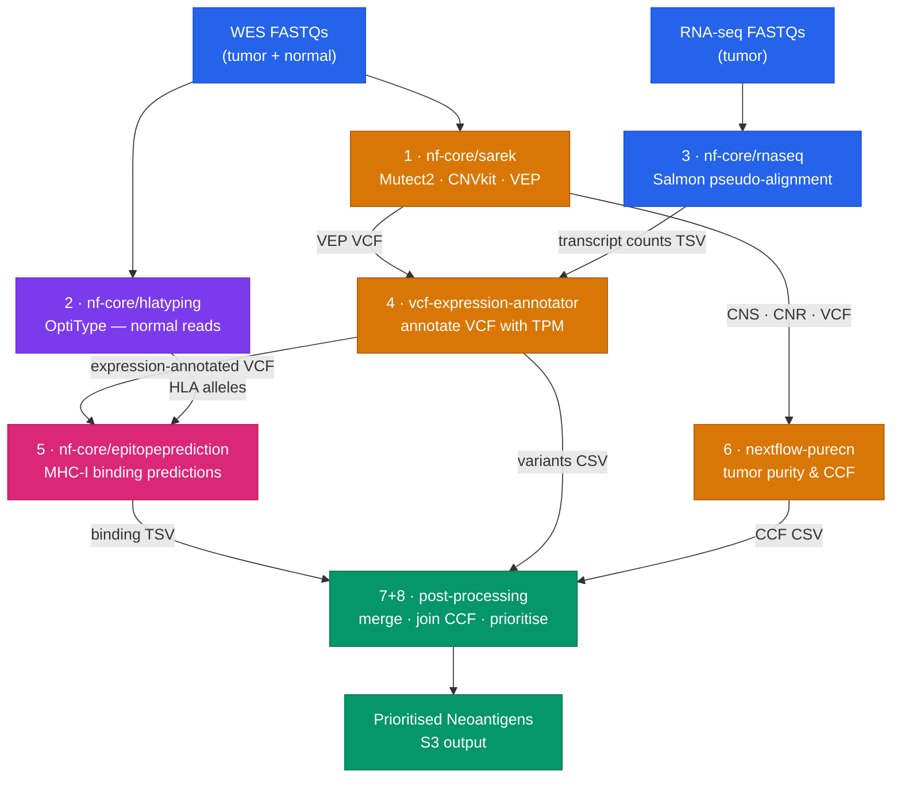

# neoantigen-prefect

Prefect 3 orchestration layer for end-to-end neoantigen prediction from tumor–normal WES and RNA-seq data, running all compute on [Seqera Platform](https://seqera.io).

This repo contains no Nextflow code. It launches 7 Nextflow pipelines in dependency order via the Seqera Platform API, polling each run until completion before triggering downstream steps. All heavy compute runs on AWS Batch through Seqera Platform.

---

## Pipeline DAG



Steps 1, 2, and 3 launch in parallel. Steps 4 and 6 run in parallel after sarek. Step 5 runs after 4 and 2. Steps 7+8 run after 5, 4, and 6.

---

## Repository Structure

`.seqera/` is the single source of truth for all Python modules. The CLI entrypoints and tests import from there.

```
neoantigen-prefect/
├── .seqera/                        # Single source of truth for all Python modules
│   ├── neoantigen_flow.py          # Prefect flow — DAG definition + pipeline params
│   ├── tasks.py                    # Prefect tasks: pipeline launch + poll, dataset upload
│   ├── seqera_client.py            # Seqera Platform REST API client
│   ├── config.py                   # SeqeraConfig, PipelineIds, output path helpers
│   ├── serve_flow.py               # Prefect deployment server (for Prefect UI option)
│   ├── Dockerfile                  # Container image for the Studio session
│   ├── environment.yaml            # Conda environment — applied automatically by Studios
│   └── studio-config.yaml          # Seqera Data Studios session configuration
├── run_flow.py                     # CLI entrypoint — all arguments explicit
├── run_patient.py                  # CLI convenience launcher — derives paths from PID
├── samplesheets/                   # Per-patient input samplesheets
├── tests/
├── pyproject.toml
└── README.md
```

---

## Seqera Launchpad Pipelines

The following pipelines must be added to your Seqera workspace before running. Pipeline IDs are stored in `.seqera/config.py`.

| Step | Pipeline | Version | Source |
|------|----------|---------|--------|
| 1 | nf-core/sarek | 3.5.1 | https://github.com/nf-core/sarek |
| 2 | hlatyping | 2.2.0 | https://github.com/nf-core/hlatyping |
| 3 | nf-core/rnaseq | latest | https://github.com/nf-core/rnaseq |
| 4 | vcf-expression-annotator | latest | https://github.com/tylergross97/vcf_expression_annotation |
| 5 | nf-core/epitopeprediction | latest | https://github.com/nf-core/epitopeprediction |
| 6 | nextflow-purecn | latest | https://github.com/tylergross97/nextflow_purecn |
| 7+8 | post-processing | latest | https://github.com/tylergross97/post-processing |

---

## Running the Flow

There are two options, both using a Seqera Data Studios session.

---

### Option A — Prefect UI (recommended)

The Studio session is pre-configured to automatically open the Prefect UI with the `neoantigen-prediction` deployment registered and ready.

#### 1. Create the Studio session

1. Navigate to **Data Studios** in your Seqera workspace and click **New studio**
2. Select this Git repository and the `main` branch
3. Under **Environment variables**, add:

   | Variable | Description |
   |---|---|
   | `SEQERA_ACCESS_TOKEN` | Your Seqera Platform personal access token |
   | `SEQERA_COMPUTE_ENV_ID` | Compute environment ID (if different from default) |
   | `SEQERA_WORK_DIR` | S3 work directory (if different from default) |

4. Click **Add** — the session builds and opens the Prefect UI automatically

#### 2. Submit a run

1. Click the **Deployments** tab
2. Select **neoantigen-prediction**
3. Click **Quick run** and fill in the parameters:
   - `patient_id` — e.g. `PID262622`
   - `wes_samplesheet_csv` — S3 URI or inline CSV
   - `hlatyping_samplesheet_csv` — S3 URI or inline CSV
   - `rnaseq_samplesheet_csv` — S3 URI or inline CSV
   - `sex` — `XX` or `XY` (default: `XX`)
   - `tumor_sample_name` — defaults to `{patient_id}_T`
   - `normal_sample_name` — defaults to `{patient_id}_N`
4. Click **Run** — the Prefect UI shows live task status as the flow progresses

Samplesheet parameters accept either an S3 URI (content is fetched automatically) or raw CSV text pasted directly into the form field.

---

### Option B — CLI

Run the flow directly from a terminal — locally or from within a Studio session.

Set the required environment variables:

```bash
export SEQERA_ACCESS_TOKEN=your_token_here
```

Use `run_patient.py` — derives samplesheet paths, sex, and sample names automatically from the patient ID:

```bash
python run_patient.py PID262622
```

Samplesheets must exist at `samplesheets/{PID}_wes.csv`, `samplesheets/{PID}_hlatyping.csv`, and `samplesheets/{PID}_rnaseq.csv`.

For long-running flows (sarek + RNA-seq can take 6–12 hours), use `nohup` to keep the process alive if the session disconnects:

```bash
nohup python run_patient.py PID262622 > neoantigen_PID262622.log 2>&1 &
echo "PID: $!"
tail -f neoantigen_PID262622.log
```

To resume after a crash, pass `--resume-workflow` for each pipeline that was already running or completed:

```bash
python run_patient.py PID262622 \
  --resume-workflow "nf-core/sarek:WORKFLOW_ID" \
  --resume-workflow "nf-core/rnaseq:WORKFLOW_ID"
```

If the referenced run already SUCCEEDED, it is skipped. If FAILED or CANCELLED, it resumes from the Nextflow cache.

**Pipeline name keys for `--resume-workflow`** (must match exactly):

| Pipeline | Key |
|----------|-----|
| nf-core/sarek | `nf-core/sarek` |
| nf-core/hlatyping | `hlatyping` |
| nf-core/rnaseq | `nf-core/rnaseq` |
| vcf-expression-annotator | `vcf-expression-annotator` |
| nf-core/epitopeprediction | `nf-core/epitopeprediction` |
| nextflow-purecn | `PureCN` |
| post-processing | `post-processing` |

#### Full CLI (explicit arguments)

```bash
python run_flow.py \
  --patient-id PID262622 \
  --wes-samplesheet samplesheets/PID262622_wes.csv \
  --hlatyping-samplesheet samplesheets/PID262622_hlatyping.csv \
  --rnaseq-samplesheet samplesheets/PID262622_rnaseq.csv \
  --tumor-sample PID262622_T \
  --normal-sample PID262622_N \
  --sex XX
```

---

## Samplesheet Formats

**WES (`nf-core/sarek`):**
```csv
patient,sex,status,sample,lane,fastq_1,fastq_2
PID001,XX,0,PID001_N,1,s3://bucket/normal_R1.fastq.gz,s3://bucket/normal_R2.fastq.gz
PID001,XX,1,PID001_T,1,s3://bucket/tumor_R1.fastq.gz,s3://bucket/tumor_R2.fastq.gz
```

**HLA typing (`nf-core/hlatyping` — normal reads only):**
```csv
sample,fastq_1,fastq_2,seq_type
PID001_N,s3://bucket/normal_R1.fastq.gz,s3://bucket/normal_R2.fastq.gz,dna
```

**RNA-seq (`nf-core/rnaseq`):**
```csv
sample,fastq_1,fastq_2,strandedness
PID001_T,s3://bucket/rna_R1.fastq.gz,s3://bucket/rna_R2.fastq.gz,auto
```

---

## Outputs

All outputs land under `s3://neoantigen-test-wujcfscfs/neoantigen/{patient_id}/`:

```
PID001/
├── sarek/
├── hlatyping/
├── rnaseq/
├── vcf_expression_annotator/
├── epitopeprediction/
├── purecn/
└── post_processing/
    ├── {sample}/merged_df_final2.csv        # all candidates with binding predictions
    ├── {sample}_filtered_variants.csv        # prioritised neoantigens with CCF
    └── *.png                                 # QC plots
```

---

## Testing

```bash
uv run pytest tests/ -v
```

---

## Known Issues

### Fusion + pipeline chaining (for Seqera engineering)

**Symptom:** The first process of a downstream pipeline (`CNS_TO_SEG` in PureCN, `SPLIT_TRANSCRIPT_COUNTS` in vcf-expression-annotator) fails with `FileNotFoundError` on an input file that exists in S3.

**Root cause:** When Fusion resolves a cross-pipeline input via a symlink (e.g. `ln -s /fusion/s3/bucket/sarek-output/file.cns file.cns`), it calls `PopulateDirectory` which does an S3 LIST on the target path with a trailing slash. For a file (not a directory prefix), this returns 0 results. A prior Fusion version recovered by falling back to a direct byte-range GET on the exact key (visible in the Fusion log as a `prefetching` → `download start` sequence). The current version does not — it returns ENOENT and the process fails.

This is specific to the first process of a downstream pipeline because:
- Files produced *within* the same pipeline run are already in Fusion's local write cache and are found without an S3 lookup.
- Files produced by a *different* pipeline run exist only in S3, requiring a cold lookup that hits the broken code path.

**Workaround (current):** `stageInMode = 'copy'` for the affected process via `config_text_extra` in `neoantigen_flow.py`. This makes Nextflow physically copy the input bytes into the task work directory (via direct S3 on the head node) instead of creating a Fusion symlink, so Fusion finds the file via a normal work-dir listing rather than cross-directory symlink resolution.

**Confirmed by:** Comparing `.fusion.log` between a working run (old Fusion version — has `prefetching` entry after `PopulateDirectory children=0`) and a failing run (new Fusion version — terminates after `PopulateDirectory children=0` with no fallback).

---

## Related Repositories

| Repo | Description |
|------|-------------|
| [neoantigen_prediction_workflow](https://github.com/tylergross97/neoantigen_prediction_workflow) | Nextflow meta-pipeline and biological background |
| [post-processing](https://github.com/tylergross97/post-processing) | Downstream + tertiary analysis |
| [vcf_expression_annotation](https://github.com/tylergross97/vcf_expression_annotation) | VCF expression annotator pipeline |
| [nextflow_purecn](https://github.com/tylergross97/nextflow_purecn) | Nextflow wrapper for PureCN clonality estimation |
