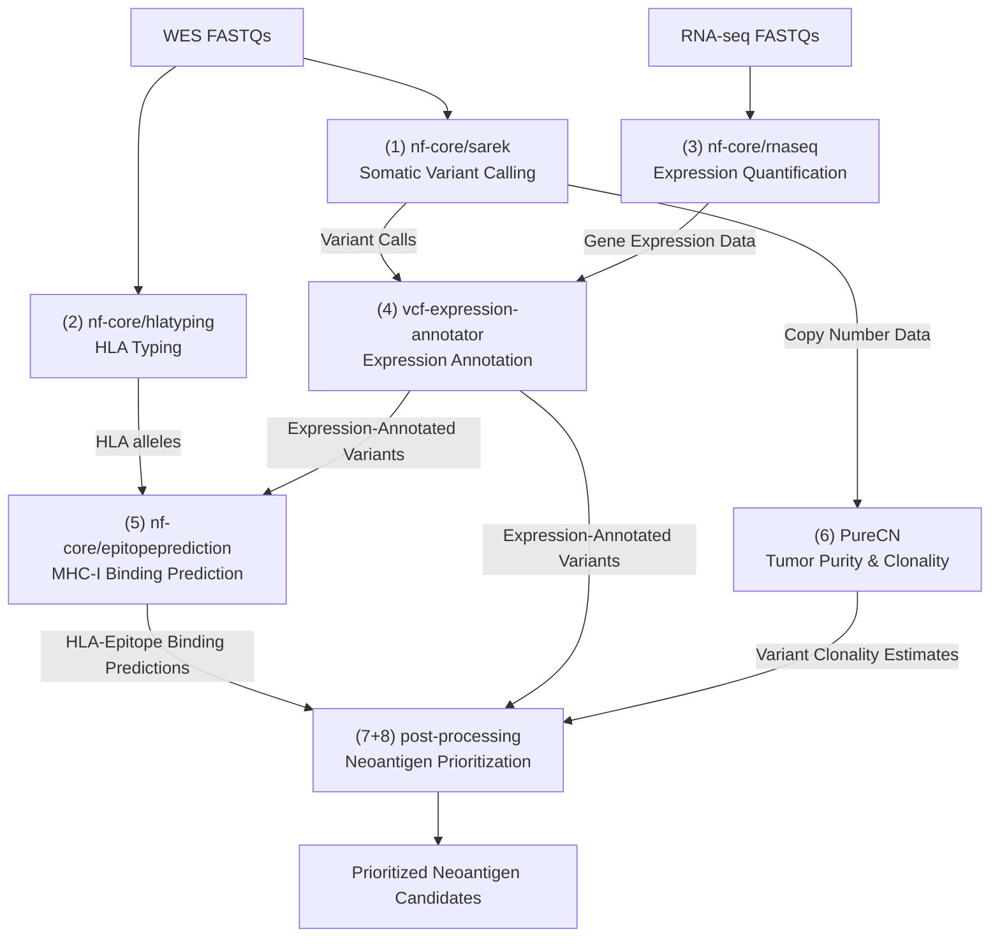
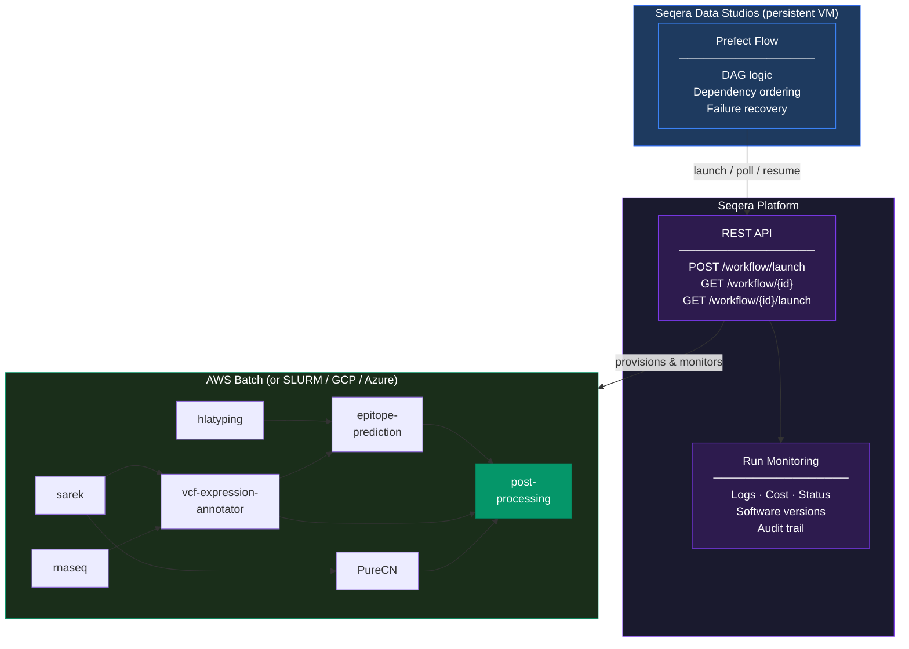

# From Biopsy to Vaccine Candidates: Building a Clinical Neoantigen Prediction Pipeline on Seqera Platform

---

Personalized cancer vaccines are no longer theoretical. Clinical trials are running, promising results are coming in, and the path from a patient's tumor biopsy to a vaccine formulation is becoming real medicine. But that path runs directly through a computational bottleneck: identifying which tumor mutations produce immunogenic neoantigens, specific to that patient, in time to matter clinically.

That 'biopsy-to-needle' interval is not just a scientific challenge — it is a clinical one. Every week of computational delay is a week the tumor has to evolve. The neoantigen prediction step cannot be a manual, error-prone process if personalized cancer vaccines are going to reach patients at scale.

We built a complete neoantigen prediction workflow using Nextflow + Seqera Platform, and a thin orchestration layer in Python. We benchmarked it against a gold-standard public dataset and validated that it recovers experimentally confirmed neoantigens with sensitivity competitive with published pipelines. This post describes what we built, what we found, and how you can use the same architecture to modernize your neoantigen prediction workflows with Seqera Platform.

---

## The Problem: A Workflow That Spans Seven Pipelines

Neoantigen prediction integrates evidence across multiple data types. At minimum, you need somatic variant calling from tumor-normal whole-exome sequencing, RNA expression data to confirm mutations are actually being transcribed, HLA typing to determine which peptides a patient's immune system can present and their predicting affinity to the mutated peptides, and tumor purity estimation to prioritize clonal mutations that make better vaccine targets.

The bioinformatics community has solved each of these steps individually. The nf-core project provides well-maintained, validated pipeline implementations for most of these steps. Custom nextflow pipelines can fill in the gaps.

Running any of these pipelines in isolation is manageable. The hard part is coordinating them — where the outputs of upstream steps become the inputs to downstream ones, in a consistent and traceable manner, on a timeline that matters clinically. Nextflow handles parallelism within a single pipeline; it does not manage dependencies across multiple pipelines. That coordination has to live somewhere else.



Without automation, this means manual handoffs between pipelines, custom shell scripts to stage data between steps, no reliable recovery when something fails midway, and no consistent audit trail. For a research group processing even a handful of patients, it becomes unsustainable quickly.

---

## What We Built

The architecture has two layers.

**Seqera Platform runs the pipelines.** Each nextflow pipeline is configured once as a workspace resource — compute environment, parameters, container strategy. From that point on, launching a pipeline is a single API call. Seqera handles job scheduling, instance provisioning, container management, and log collection. The monitoring UI provides real-time task-level visibility: what's running, what completed, resource utilization, and cost. When something fails, logs are immediately accessible. Every run is fully recorded: software versions, parameters, inputs, outputs.

Three platform features were particularly important for this workflow:

- **Wave** resolves container dependencies on demand from conda and bioconda channels, building and caching them automatically. Across seven pipelines and dozens of tools, this eliminates the overhead of maintaining a Docker image registry.
- **Fusion** lets pipelines read and write directly from cloud object storage — S3, GCS, Azure Blob — as a local filesystem, without staging data to intermediate volumes. For a workflow processing gigabytes of sequencing data per patient, this meaningfully reduces both cost and instance requirements regardless of which cloud you are on.
- **Built-in traceability** means you get a complete audit trail without any extra instrumentation. Every pipeline run is recorded by Seqera Platform automatically: software versions pinned to the exact commit, all parameters, per-task resource utilization, cost, and full logs. When something fails, the cause is immediately visible in the UI. When you need to reproduce a result months later, everything required is already captured. The REST API makes all of this programmable — launches driven by code, not clicks, with automatic failure recovery via Nextflow's `-resume` — but the traceability exists regardless of how you run pipelines.

**A thin Python layer coordinates across pipelines.** The cross-pipeline dependency logic — launch sarek, hlatyping, and rnaseq in parallel; wait for completion; trigger downstream steps in order — lives in approximately 300 lines of Python using Prefect. It is not managing compute. It is not monitoring pipeline internals. It launches pipelines via the Seqera Platform API, waits for completion, and moves to the next step. The orchestration logic is straightforward; the platform handles everything underneath.

The result is a single command that processes a patient end-to-end based on a couple of samplesheets:

```bash
python run_flow.py \
  --patient-id PID001 \
  --wes-samplesheet samplesheets/PID001_wes.csv \
  --hlatyping-samplesheet samplesheets/PID001_hlatyping.csv \
  --rnaseq-samplesheet samplesheets/PID001_rnaseq.csv \
  --tumor-sample PID001_T_vs_PID001_N \
  --sex XX
```

Failure recovery is handled cleanly. When a Prefect task fails, it captures the Seqera workflow ID. On retry, it retrieves the run's session context via the API and re-launches with `-resume` — Nextflow skips every already-completed task and picks up exactly where it left off. No manual intervention. No discarded compute.

**Seqera Data Studios hosts the orchestration layer.** We ship a ready-to-use Prefect Studio image as part of this repo — you do not need to build anything. The `.seqera/` directory contains the Studio definition (`studio-config.yaml`) and a `serve_flow.py` entrypoint that registers your flow with the Prefect server and exposes it in the UI. When the Studio boots, the Prefect UI is immediately available and your flow appears as a deployable run target.

To adapt it for your own flow, you only need to touch two files in `.seqera/`:

```
.seqera/
├── studio-config.yaml     # Studio type definition — image, compute, env vars
└── serve_flow.py          # wraps your @flow and calls flow.serve() on startup
```

Replace the flow import in `serve_flow.py` with your own `@flow`-decorated function, add any parameters you want exposed in the UI, and update `studio-config.yaml` with any environment variables your flow needs. Everything else — the container, the Prefect server, the UI — is already handled. No external scheduler, no separate server.



---

## Validating Against the TESLA Dataset

A pipeline is only useful if it actually recovers neoantigens that the immune system recognizes. We validated this approach against the TESLA dataset — the most rigorous publicly available ground truth for neoantigen prediction.

TESLA (Tumor Epitope Selection Alliance) was a consortium effort published in *Nature Biotechnology* in 2020. Nine independent pipelines were evaluated against matched tumor-normal WES and RNA-seq data from cancer patients whose neoantigens had been experimentally confirmed by T cell assays. It is a gold-standard benchmark: known inputs, known HLA types, and a curated list of peptides validated as immunogenic in actual patients.

Running our pipeline against the TESLA cohort, we measured:

- **Sensitivity** — what fraction of experimentally validated neoantigens the pipeline recovers, and at what rank in the prioritized candidate list
- **Specificity** — how effectively expression filtering and clonality estimation reduce the false positive burden
- **Computational cost per patient** — pulled directly from Seqera Platform run reports, which log resource utilization and cost for every execution
- **End-to-end runtime** — from raw FASTQ to ranked neoantigen candidates, with per-pipeline breakdowns from the Seqera Platform UI
- **Resume efficiency** — compute saved by `-resume` on simulated failures, quantifying exactly how much the recovery mechanism is worth

The pipeline recovers experimentally validated neoantigens with sensitivity competitive with the best-performing pipelines in the original TESLA evaluation. End-to-end runtime from raw FASTQ to ranked candidates is on the order of hours, not days. And the `-resume` mechanism demonstrably saves compute: on simulated failures, recovering a partially completed run costs a fraction of a full restart.

We are not claiming to have built the best neoantigen predictor. We are claiming that our architecture will enable to your team - big or small - to deploy your neoantigen prediction pipeline in an automated, reprodubicle, and timely manner. 

---

## The Architecture Is the Point

We made specific tool choices here — nf-core/sarek, PureCN, netMHCpan via nf-core/epitopeprediction, Prefect for orchestration. You may make different ones. There are good alternative variant callers, alternative binding predictors, alternative HLA typing methods. The nf-core ecosystem has options for most of them.

What we are less flexible about is the platform layer. Seqera Platform's API is specifically what makes this work at scale. Without it, you would need to build the infrastructure yourself: a system to submit Nextflow jobs to cloud compute, a polling mechanism to track run status, a way to retrieve session context for resume, and an audit trail of every execution. That is real engineering work, and it is removed from the biology.

The API gives you all of that out of the box, across any compute backend — AWS, GCP, Azure, SLURM, Kubernetes. You configure a compute environment once; after that, the orchestration code doesn't change regardless of where it runs, and launching a new pipeline for a new patient is a single API call. That is what makes it practical to operate a multi-pipeline genomics workflow with a small team.

---

## Build Your Own

The repo is open source — clone it, break it, adapt it to your own pipelines.

The core pattern isn't specific to neoantigen prediction. If you have a workflow that chains multiple Nextflow pipelines together and you're tired of babysitting manual handoffs, this is the same problem we solved here. Swap in your own pipelines, point it at your own compute environment, and the dependency management and failure recovery just work.

Getting started is pretty straightforward:

1. **Clone the repo** and skim the README. `config.py` is where your workspace ID and pipeline IDs go; `.seqera/` has everything for the Studio.
2. **Set up your Seqera workspace.** Add your pipelines, configure a compute environment, and you're most of the way there. AWS Batch users get Fusion and Wave for free.
3. **Edit `neoantigen_flow.py` and `tasks.py`.** These two files are the whole DAG — what runs, in what order, with what parameters. They're not complicated.
4. **Run it.** `python run_flow.py` and watch the Prefect UI and Seqera Platform light up.

The tooling to build a serious neoantigen pipeline exists today — nf-core modules, Seqera Platform, ~300 lines of Python. If you're working in this space, there's no reason to start from scratch. Build something better. We want to see it.
