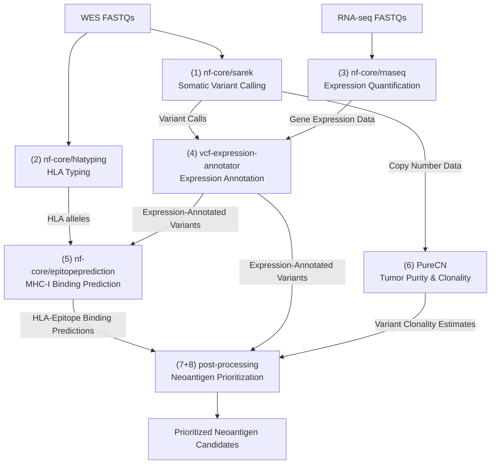
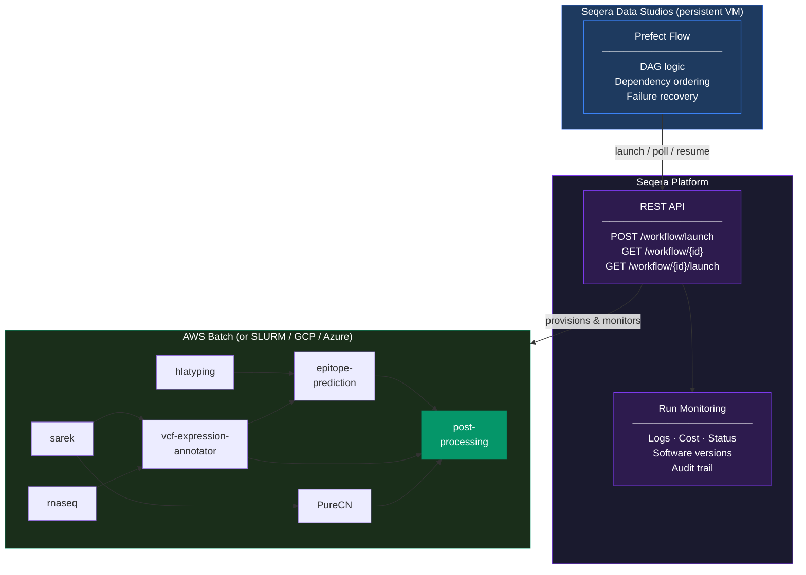

# From Biopsy to Vaccine Candidates: Building a Clinical Neoantigen Prediction Pipeline on Seqera Platform

---

Personalized cancer vaccines are no longer theoretical. Clinical trials are running, results are coming in, and the path from a patient's tumor biopsy to a vaccine formulation is becoming real medicine. But that path runs directly through a computational bottleneck: identifying which tumor mutations produce immunogenic neoantigens, specific to that patient, from that tumor, in time to matter clinically.

That biopsy-to-needle interval is not just a scientific challenge — it is a clinical one. Vaccine manufacturing pipelines have lead times. Patients are being treated. Every week of computational delay is a week the tumor has to evolve. The neoantigen prediction step cannot be a manual, error-prone process if personalized cancer vaccines are going to reach patients at scale.

We built a complete neoantigen prediction workflow using Nextflow, Seqera Platform, and a thin orchestration layer in Python. We benchmarked it against a gold-standard public dataset and validated that it recovers experimentally confirmed neoantigens with sensitivity competitive with published pipelines. This post describes what we built, what we found, and how you can use the same architecture for your own work.

---

## The Problem: A Workflow That Spans Seven Pipelines

Neoantigen prediction integrates evidence across multiple data types. At minimum, you need somatic variant calling from tumor-normal whole-exome sequencing, RNA expression data to confirm mutations are actually being transcribed, HLA typing to determine which peptides a patient's immune system can present, MHC-I binding prediction across patient-specific alleles, and tumor purity estimation to prioritize clonal mutations that make better vaccine targets.

The bioinformatics community has solved each of these steps individually. The nf-core project provides well-maintained, validated pipeline implementations for most of these steps. Custom nextflow pipelines can fill in the gaps.

The hard part is not running any one of these pipelines. The hard part is coordinating them — where the outputs of upstream steps become the inputs to downstream ones, across a cohort of patients, on a timeline that matters clinically. Nextflow handles parallelism within a single pipeline; it does not manage dependencies across multiple pipelines. That coordination has to live somewhere else.



Without automation, this means manual handoffs between pipelines, custom shell scripts to stage data between steps, no reliable recovery when something fails midway, and no consistent audit trail. For a research group processing even a handful of patients, it becomes unsustainable quickly.

---

## What We Built

The architecture has two layers.

**Seqera Platform runs the pipelines.** Each nextflow pipeline is configured once as a workspace resource — compute environment, parameters, container strategy. From that point on, launching a pipeline is a single API call. Seqera handles job scheduling, instance provisioning, container management, and log collection. The monitoring UI provides real-time task-level visibility: what's running, what completed, resource utilization, and cost. When something fails, logs are immediately accessible. Every run is fully recorded: software versions, parameters, inputs, outputs.

Three platform features were particularly important for this workflow:

- **Wave** resolves container dependencies on demand from conda and bioconda channels, building and caching them automatically. Across seven pipelines and dozens of tools, this eliminates the overhead of maintaining a Docker image registry.
- **Fusion** lets pipelines read and write directly from cloud object storage — S3, GCS, Azure Blob — as a local filesystem, without staging data to intermediate volumes. For a workflow processing gigabytes of sequencing data per patient, this meaningfully reduces both cost and instance requirements regardless of which cloud you are on.
- **The API** is what makes this approach work — not just at cohort scale, but for a single patient. Every operation in the UI is available as a REST call: launching pipelines, polling status, retrieving logs, fetching the session context needed to resume a failed run. Executions are driven by code, not clicks. Parameters are version-controlled, runs are auditable, and failures recover without manual intervention. 

**A thin Python layer coordinates across pipelines.** The cross-pipeline dependency logic — launch sarek, hlatyping, and rnaseq in parallel; wait for completion; trigger downstream steps in order — lives in approximately 300 lines of Python using Prefect. It is not managing compute. It is not monitoring pipeline internals. It calls the Seqera Platform API: launch this pipeline, wait until it completes, then launch the next one. The entire orchestration layer is just structured API calls.

The result is a single command that processes a patient end-to-end:

```bash
python run_flow.py \
  --patient-id PID001 \
  --wes-samplesheet samplesheets/PID001_wes.csv \
  --hlatyping-samplesheet samplesheets/PID001_hlatyping.csv \
  --rnaseq-samplesheet samplesheets/PID001_rnaseq.csv \
  --tumor-sample PID001_T_vs_PID001_N \
  --sex XX
```

Failure recovery is handled cleanly. When a Prefect task fails, it captures the Seqera workflow ID. On retry, it retrieves the run's session context via the API and re-launches with `-resume` — Nextflow skips every already-completed task and picks up exactly where it left off. No manual intervention. No discarded compute.

**Seqera Data Studios is where the Prefect flow actually runs.** Studios provisions a persistent VM — pre-configured with the repo, dependencies, and environment — directly within the Seqera workspace. There is no separate server to maintain, no local machine that needs to stay on, and no external scheduler to configure. You open a terminal, provide your access token, and run the flow with `nohup`. Since the VM persists independently of your browser session, the Prefect polling loop runs in the background for hours without any connection required. Reconnect at any time to check progress:

```
(base) root@ip-172-31-33-17:/workspace# tail neoantigen_PID001.log
13:04:40 | INFO | [PureCN] status=RUNNING
13:04:50 | INFO | [vcf-expression-annotator] status=RUNNING
13:08:50 | INFO | 'vcf-expression-annotator' SUCCEEDED (run otLlfd5MTXRFP)
13:08:58 | INFO | Launching 'nf-core/epitopeprediction' ... Run launched: wkVLdnGo4CODR
```

It is a Seqera-native execution environment for the orchestration layer, sitting alongside the pipelines it is coordinating.



---

## Validating Against the TESLA Dataset

A pipeline is only useful if it actually recovers neoantigens that the immune system recognizes. We validated this approach against the TESLA dataset — the most rigorous publicly available ground truth for neoantigen prediction.

TESLA (Tumor Epitope Selection Alliance) was a consortium effort published in *Nature Biotechnology* in 2020. Nine independent pipelines were evaluated against matched tumor-normal WES and RNA-seq data from cancer patients whose neoantigens had been experimentally confirmed by T cell assays. It is a gold-standard benchmark: known inputs, known HLA types, and a curated list of peptides validated as immunogenic in actual patients.

Running our pipeline against the TESLA cohort, we measured:

- **Sensitivity** — what fraction of experimentally validated neoantigens the pipeline recovers, and at what rank in the prioritized candidate list
- **Specificity** — how effectively expression filtering and clonality estimation reduce the false positive burden
- **Computational cost per patient** — pulled directly from Seqera Platform run reports, which log resource utilization and cost for every execution
- **End-to-end runtime** — from raw FASTQ to ranked neoantigen candidates, with per-pipeline breakdowns from the Seqera Platform UI
- **Resume efficiency** — compute saved by `-resume` on simulated failures, quantifying exactly how much the recovery mechanism is worth

The pipeline recovers experimentally validated neoantigens with sensitivity competitive with the best-performing pipelines in the original TESLA evaluation. Expression filtering and clonality estimation meaningfully reduce the false positive burden — the ranked candidate list is short enough to be actionable. End-to-end runtime from raw FASTQ to ranked candidates is on the order of hours, not days. And the `-resume` mechanism demonstrably saves compute: on simulated failures, recovering a partially completed run costs a fraction of a full restart.

We are not claiming to have built the best neoantigen predictor. We are claiming that the architecture is sound, the tooling is validated against a rigorous ground truth, and the operational overhead of running it at cohort scale is low enough for a small research group to sustain — without a dedicated bioinformatics infrastructure team.

Full benchmark results, per-sample breakdowns, and cost metrics will be published in a follow-up post.

---

## The Architecture Is the Point

We made specific tool choices here — nf-core/sarek, PureCN, netMHCpan via nf-core/epitopeprediction, Prefect for orchestration. You may make different ones. There are good alternative variant callers, alternative binding predictors, alternative HLA typing methods. The nf-core ecosystem has options for most of them.

What we are less flexible about is the platform layer. Seqera Platform's API is specifically what makes this work at scale. Without it, you would need to build the infrastructure yourself: a system to submit Nextflow jobs to cloud compute, a polling mechanism to track run status, a way to retrieve session context for resume, and an audit trail of every execution. That is real engineering work, and it is removed from the biology.

The API gives you all of that out of the box, across any compute backend — AWS, GCP, Azure, SLURM, Kubernetes. You configure a compute environment once; after that, the orchestration code doesn't change regardless of where it runs, and launching a new pipeline for a new patient is a single API call. That is what makes it practical to operate a multi-pipeline genomics workflow with a small team.

---

## Start Here

The orchestration code is open source and available at **[LINK TO GITHUB REPO]**. It requires a Seqera Platform account, a compute environment configured in your workspace (AWS, GCP, Azure, SLURM, or Kubernetes), and the seven pipelines added to your launchpad. The nf-core pipelines used here are freely available and community-maintained.

Seqera Platform offers a free tier for academic research groups. If you are working on personalized cancer vaccines, multi-omics workflows, or any research where the gap between biopsy and answer needs to close — this architecture gives you a working starting point on whatever infrastructure you already have.

Build something better. We want to see it.

---

*Questions and contributions are welcome at **[GITHUB LINK]**. The TESLA dataset is available under controlled access via dbGaP (accession phs001910) for researchers with an approved data access request.*
